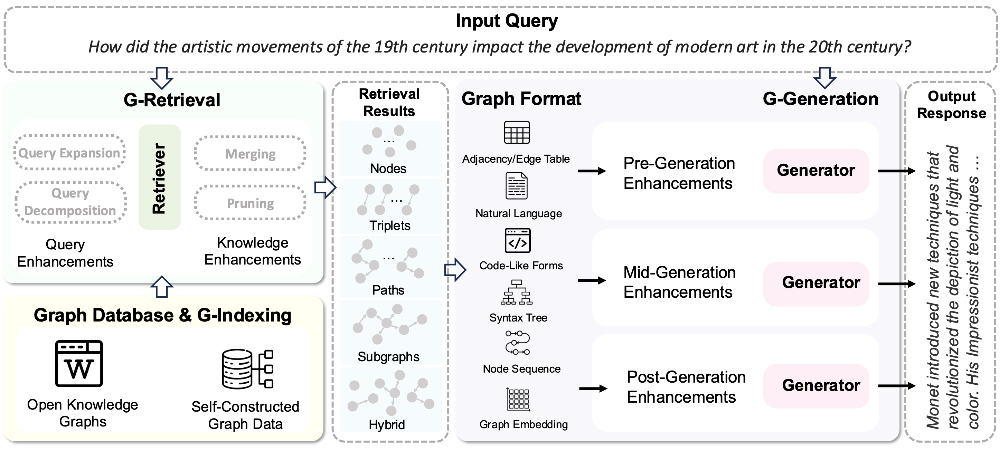
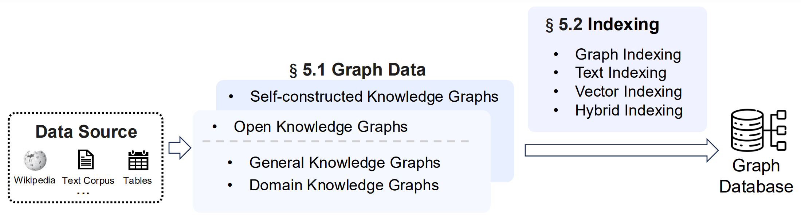
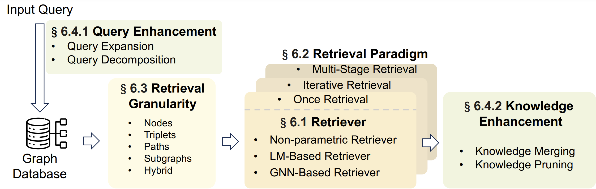
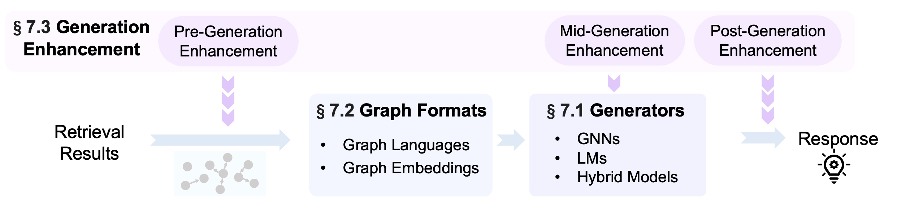
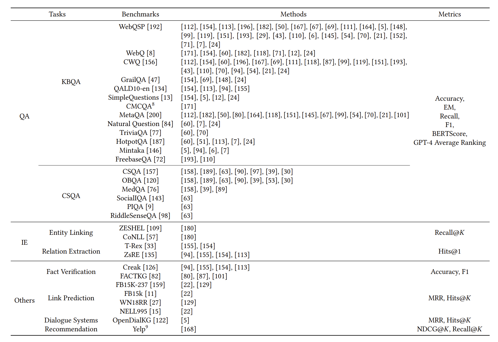

# Graph Retrieval-Augmented Generation: A Survey

Recently, Retrieval-Augmented Generation (RAG) has achieved remarkable success in addressing the challenges of Large Language Models (LLMs) without necessitating retraining. By referencing an external knowledge base, RAG refines LLM outputs, effectively mitigating issues such as ``hallucination'', lack of domain-specific knowledge, and outdated information. However, the complex structure of relationships among different entities in databases presents challenges for RAG systems. In response, GraphRAG leverages structural information across entities to enable more precise and comprehensive retrieval, capturing relational knowledge and facilitating more accurate, context-aware responses. Given the novelty and potential of GraphRAG, a systematic review of current technologies is imperative. This paper provides the first comprehensive overview of GraphRAG methodologies. We formalize the GraphRAG workflow, encompassing Graph-Based Indexing, Graph-Guided Retrieval, and Graph-Enhanced Generation. We then outline the core technologies and training methods at each stage. Additionally, we examine downstream tasks, application domains, evaluation methodologies, and industrial use cases of GraphRAG. Finally, we explore future research directions to inspire further inquiries and advance progress in the field.

**Paper Link:** https://arxiv.org/abs/2408.08921

## 📆 Updates

- [2024/9/10] We released the second version and created the repository on GitHub.
- [2024/8/15] We released the first version of our survey on arXiv.

## 📋 Table of Contents

- [Overview of GraphRAG](#overview)
- [Graph-Based Indexing](#indexing)
- [Graph-Guided Retrieval](#retrieval)
- [Graph-Enhanced Generation](#generation)
- [Downstream Tasks](#tasks)
- [Citation](#citation)
- [Contact Us](#contact)

## <a name="overview">📕 Overview of GraphRAG



We divide GraphRAG into three stages: G-Indexing, G-Retrieval, and G-Generation. We categorize the retrieval sources into open-source knowledge graphs and self-constructed graph data. Various enhancing techniques like query enhancement and knowledge enhancement may be adopted to boost the relevance of the results. Unlike RAG, which uses retrieved text directly for generation, GraphRAG requires converting the retrieved graph information into patterns acceptable to generators to enhance the task performance.

## <a name="indexing">📗 Graph-Based Indexing



The construction and indexing of graph databases form the foundation of GraphRAG, where the quality of the graph database directly impacts GraphRAG's performance. 


## <a name="retrieval">📘 Graph-Guided Retrieval


In GraphRAG, the retrieval process is crucial for ensuring the quality and relevance of generated outputs by extracting pertinent and high-quality graph data from external graph databases. However, retrieving graph data presents two significant challenges: (1) **Explosive Candidate Subgraphs**: As the graph size increases, the number of candidate subgraphs grows exponentially, requiring heuristic search algorithms to efficiently explore and retrieve relevant subgraphs. (2) **Insufficient Similarity Measurement**: Accurately measuring similarity between textual queries and graph data necessitates the development of algorithms capable of understanding both textual and structural information. Considerable efforts have previously been dedicated to optimizing the retrieval process to address the above challenges. This survey focuses on examining various aspects of the retrieval process within GraphRAG, including the selection of the retriever, retrieval paradigm, retrieval granularity, and effective enhancement techniques.


## <a name="generation">📙 Graph-Enhanced Generation


The generation stage is another crucial step in GraphRAG, aimed at integrating the retrieved graph data with the query to enhance response quality. In this stage, suitable generation models must be selected based on the downstream tasks. The retrieved graph data is then transformed into formats compatible with the generators. The generator takes both the query and the transformed graph data as inputs to produce the final response. Beyond these fundamental processes, generative enhancement techniques can further improve the output by intensifying the interaction between the query and the graph data and enriching the content generation itself.


## <a name="tasks">🔎 Downstream Tasks



## 📑 Paper List
### Graph-Based Indexing
#### Graph Data
##### Self-Constructed Data
+ ATLANTIC: Structure-Aware Retrieval-Augmented Language Model for Interdisciplinary Science, arxiv 2023, [[paper]](https://arxiv.org/abs/2311.12289).
+ Graph Neural Network Enhanced Retrieval for Question Answering of LLMs, arxiv 2024, [[paper]](https://arxiv.org/abs/2406.06572).
+ Knowledge Graph Prompting for Multi-Document Question Answering, AAAI 2024, [[paper]](https://ojs.aaai.org/index.php/AAAI/article/view/29889).
+ Graph-Based Retriever Captures the Long Tail of Biomedical Knowledge, arxiv 2024, [[paper]](https://arxiv.org/abs/2402.12352).
+ From Local to Global: A Graph RAG Approach to Query-Focused Summarization, arxiv 2024, [[paper]](https://arxiv.org/abs/2404.16130).
+ LightRAG: Simple and Fast Retrieval-Augmented Generation, arxiv 2024, [[paper]](https://arxiv.org/abs/2410.05779).
+ HippoRAG: Neurobiologically Inspired Long-Term Memory for Large Language Models, NeurIPS 2024, [[paper]](https://papers.nips.cc/paper_files/paper/2024/hash/6ddc001d07ca4f319af96a3024f6dbd1-Abstract-Conference.html).
+ DALK: Dynamic Co-Augmentation of LLMs and KG to answer Alzheimer's Disease Questions with Scientific Literature, EMNLP (Findings) 2024, [[paper]](https://aclanthology.org/2024.findings-emnlp.119/).
+ Connecting the Dots: Inferring Patent Phrase Similarity with Retrieved Phrase Graphs, NAACL (Findings) 2024, [[paper]](https://aclanthology.org/2024.findings-naacl.121/).
+ Retrieval-Augmented Generation with Knowledge Graphs for Customer Service Question Answering, SIGIR 2024, [[paper]](https://dl.acm.org/doi/10.1145/3626772.3661370).
#### Indexing
##### Graph Indexing
+ RAPTOR: Recursive Abstractive Processing for Tree-Organized Retrieval, ICLR 2024, [[paper]](https://openreview.net/forum?id=GN921JHCRw).
+ SiReRAG: Indexing Similar and Related Information for Multihop Reasoning, arxiv 2024, [[paper]](https://arxiv.org/abs/2412.06206).
+ KG-Retriever: Efficient Knowledge Indexing for Retrieval-Augmented Large Language Models, arxiv 2024, [[paper]](https://arxiv.org/abs/2412.05547).
+ HyKGE: A Hypothesis Knowledge Graph Enhanced Framework for Accurate and Reliable Medical LLMs Responses, arxiv 2023, [[paper]](https://arxiv.org/abs/2312.15883).
+ Graph Chain-of-Thought: Augmenting Large Language Models by Reasoning on Graphs, ACL (Findings 2024), [[paper]](https://aclanthology.org/2024.findings-acl.11/).
+ Reasoning on Graphs: Faithful and Interpretable Large Language Model Reasoning, ICLR 2024, [[paper]](https://openreview.net/forum?id=ZGNWW7xZ6Q).
+ Think-on-Graph 2.0: Deep and Interpretable Large Language Model Reasoning with Knowledge Graph-guided Retrieval, arxiv 2024, [[paper]](https://arxiv.org/abs/2407.10805).
+ Think-on-Graph: Deep and Responsible Reasoning of Large Language Model on Knowledge Graph, ICLR 2024, [[paper]](https://openreview.net/forum?id=nnVO1PvbTv).
+ GrapeQA: GRaph Augmentation and Pruning to Enhance Question-Answering, WWW 2023, [[paper]](https://openreview.net/forum?id=nnVO1PvbTv).
+ QA-GNN: Reasoning with Language Models and Knowledge Graphs for Question Answering, NAACL 2021, [[paper]](https://aclanthology.org/2021.naacl-main.45/).
##### Text Indexing
+ Graph Reasoning for Question Answering with Triplet Retrieval, ACL Findings 2023, [[paper]](https://aclanthology.org/2021.naacl-main.45/).
+ MVP-Tuning: Multi-View Knowledge Retrieval with Prompt Tuning for Commonsense Reasoning, ACL 2023, [[paper]](https://aclanthology.org/2023.acl-long.750/).
+ UniOQA: A Unified Framework for Knowledge Graph Question Answering with Large Language Models, arxiv 2024, [[paper]](https://arxiv.org/abs/2406.02110).
+ DecAF: Joint Decoding of Answers and Logical Forms for Question Answering over Knowledge Bases, ICLR 2024, [[paper]](https://openreview.net/forum?id=XHc5zRPxqV9).
+ From Local to Global: A Graph RAG Approach to Query-Focused Summarization, arxiv 2024, [[paper]](https://arxiv.org/abs/2404.16130).
##### Vector Indexing
+ G-Retriever: Retrieval-Augmented Generation for Textual Graph Understanding and Question Answering, NeurIPS 2024, [[paper]](https://papers.nips.cc/paper_files/paper/2024/hash/efaf1c9726648c8ba363a5c927440529-Abstract-Conference.html).
+ GRAG: Graph Retrieval-Augmented Generation, arxiv 2024, [[paper]](https://arxiv.org/abs/2405.16506).
+ Subgraph Retrieval Enhanced by Graph-Text Alignment for Commonsense Question Answering, ECML-PKDD 2024, [[paper]](https://link.springer.com/chapter/10.1007/978-3-031-70365-2_3).
##### Hybrid Indexing
+ HybridRAG: Integrating Knowledge Graphs and Vector Retrieval Augmented Generation for Efficient Information Extraction, ICAIF 2024, [[paper]](https://dl.acm.org/doi/10.1145/3677052.3698671).
+ EWEK-QA: Enhanced Web and Efficient Knowledge Graph Retrieval for Citation-based Question Answering Systems, ACL 2024, [[paper]](https://aclanthology.org/2024.acl-long.764/).

### Graph-Guided Retrieval
#### Retriever
##### Non-parametric Retriever
+ QA-GNN: Reasoning with Language Models and Knowledge Graphs for Question Answering, NAACL 2021, [[paper]](https://aclanthology.org/2021.naacl-main.45/).
+ GrapeQA: GRaph Augmentation and Pruning to Enhance Question-Answering, WWW 2023, [[paper]](https://openreview.net/forum?id=nnVO1PvbTv).
+ G-Retriever: Retrieval-Augmented Generation for Textual Graph Understanding and Question Answering, NeurIPS 2024, [[paper]](https://papers.nips.cc/paper_files/paper/2024/hash/efaf1c9726648c8ba363a5c927440529-Abstract-Conference.html).
+ Graph-Based Retriever Captures the Long Tail of Biomedical Knowledge, arxiv 2024, [[paper]](https://arxiv.org/abs/2402.12352).
+ GNN-RAG: Graph Neural Retrieval for Large Language Model Reasoning, arxiv 2024, [[paper]](https://arxiv.org/abs/2405.20139).
+ HippoRAG: Neurobiologically Inspired Long-Term Memory for Large Language Models, NeurIPS 2024, [[paper]](https://papers.nips.cc/paper_files/paper/2024/hash/6ddc001d07ca4f319af96a3024f6dbd1-Abstract-Conference.html).
+ Mixture-of-PageRanks: Replacing Long-Context with Real-Time, Sparse GraphRAG, arxiv 2024, [[paper]](https://arxiv.org/abs/2412.06078).
##### LM-based Retriever
+ Simple is Effective: The Roles of Graphs and Large Language Models in Knowledge-Graph-Based Retrieval-Augmented Generation, arxiv 2024, [[paper]](http://arxiv.org/abs/2410.20724).
+ Graph Reasoning for Question Answering with Triplet Retrieval, ACL Findings 2023, [[paper]](https://aclanthology.org/2021.naacl-main.45/).
+ DecAF: Joint Decoding of Answers and Logical Forms for Question Answering over Knowledge Bases, ICLR 2024, [[paper]](https://openreview.net/forum?id=XHc5zRPxqV9).
+ Enhancing Distractor Generation for Multiple-Choice Questions with Retrieval Augmented Pretraining and Knowledge Graph integration, ACL (Findings) 2024, [[paper]](https://aclanthology.org/2024.findings-acl.655/).
+ Subgraph Retrieval Enhanced Model for Multi-hop Knowledge Base Question Answering, ACL 2022, [[paper]](https://aclanthology.org/2022.acl-long.396/).
+ KG-GPT: A General Framework for Reasoning on Knowledge Graphs Using Large Language Models, EMNLP (Findings) 2023, [[paper]](https://aclanthology.org/2023.findings-emnlp.631/).
+ Text-To-KG Alignment: Comparing Current Methods on Classification Tasks, arxiv 2023, [[paper]](https://arxiv.org/abs/2306.02871).
+ StructGPT: A General Framework for Large Language Model to Reason over Structured Data, EMNLP 2023, [[paper]](https://aclanthology.org/2023.emnlp-main.574/).
##### GNN-based Retriever
+ GNN-RAG: Graph Neural Retrieval for Large Language Model Reasoning, arxiv 2024, [[paper]](https://arxiv.org/abs/2405.20139).

#### Retrieval Paradigm
##### Once Retrieval
+ HippoRAG: Neurobiologically Inspired Long-Term Memory for Large Language Models, NeurIPS 2024, [[paper]](https://papers.nips.cc/paper_files/paper/2024/hash/6ddc001d07ca4f319af96a3024f6dbd1-Abstract-Conference.html).
+ GRAG: Graph Retrieval-Augmented Generation, arxiv 2024, [[paper]](https://arxiv.org/abs/2405.16506).
+ Graph Reasoning for Question Answering with Triplet Retrieval, ACL (Findings) 2023, [[paper]](https://aclanthology.org/2021.naacl-main.45/).
+ G-Retriever: Retrieval-Augmented Generation for Textual Graph Understanding and Question Answering, NeurIPS 2024, [[paper]](https://papers.nips.cc/paper_files/paper/2024/hash/efaf1c9726648c8ba363a5c927440529-Abstract-Conference.html).
+ KagNet: Knowledge-Aware Graph Networks for Commonsense Reasoning, EMNLP 2019, [[paper]](https://aclanthology.org/D19-1282/).
+ QA-GNN: Reasoning with Language Models and Knowledge Graphs for Question Answering, NAACL 2021, [[paper]](https://aclanthology.org/2021.naacl-main.45/).
+ GrapeQA: GRaph Augmentation and Pruning to Enhance Question-Answering, WWW 2023, [[paper]](https://openreview.net/forum?id=nnVO1PvbTv).
+ Reasoning on Graphs: Faithful and Interpretable Large Language Model Reasoning, ICLR 2024, [[paper]](https://openreview.net/forum?id=ZGNWW7xZ6Q).
+ KG-GPT: A General Framework for Reasoning on Knowledge Graphs Using Large Language Models, EMNLP (Findings) 2023, [[paper]](https://aclanthology.org/2023.findings-emnlp.631/).
##### Iterative Retrieval
+ PullNet: Open Domain Question Answering with Iterative Retrieval on Knowledge Bases and Text, EMNLP 2019, [[paper]](https://aclanthology.org/D19-1242/).
+ Knowledge Graph Prompting for Multi-Document Question Answering, AAAI 2024, [[paper]](https://ojs.aaai.org/index.php/AAAI/article/view/29889).
+ Retrieve-Rewrite-Answer: A KG-to-Text Enhanced LLMs Framework for Knowledge Graph Question Answering, arxiv 2023, [[paper]](https://arxiv.org/abs/2309.11206).
+ KnowledgeNavigator: Leveraging Large Language Models for Enhanced Reasoning over Knowledge Graph, arxiv 2023, [[paper]](https://arxiv.org/abs/2312.15880).
+ Think-on-Graph 2.0: Deep and Interpretable Large Language Model Reasoning with Knowledge Graph-guided Retrieval, arxiv 2024, [[paper]](https://arxiv.org/abs/2407.10805).
+ Think-on-Graph: Deep and Responsible Reasoning of Large Language Model on Knowledge Graph, ICLR 2024, [[paper]](https://openreview.net/forum?id=nnVO1PvbTv).
+ Subgraph Retrieval Enhanced Model for Multi-hop Knowledge Base Question Answering, ACL 2022, [[paper]](https://aclanthology.org/2022.acl-long.396/).
+ Plan-on-Graph: Self-Correcting Adaptive Planning of Large Language Model on Knowledge Graphs, NeurIPS 2024, [[paper]](https://papers.nips.cc/paper_files/paper/2024/hash/4254e856d01a5e7b7ea050477c3ef9b9-Abstract-Conference.html).
+ StructGPT: A General Framework for Large Language Model to Reason over Structured Data, EMNLP 2023, [[paper]](https://aclanthology.org/2023.emnlp-main.574/).
+ KG-Agent: An Efficient Autonomous Agent Framework for Complex Reasoning over Knowledge Graph, arxiv 2024, [[paper]](https://aclanthology.org/2023.emnlp-main.574/).
+ Graph Chain-of-Thought: Augmenting Large Language Models by Reasoning on Graphs, ACL (Findings 2024), [[paper]](https://aclanthology.org/2024.findings-acl.11/).
+ GeAR: Graph-enhanced Agent for Retrieval-augmented Generation, arxiv 2024, [[paper]](https://arxiv.org/abs/2412.18431).
+ ODA: Observation-Driven Agent for integrating LLMs and Knowledge Graphs, ACL (Findings) 2024, [[paper]](https://aclanthology.org/2024.findings-acl.442/).
+ KnowledGPT: Enhancing Large Language Models with Retrieval and Storage Access on Knowledge Bases, arxiv 2023, [[paper]](https://arxiv.org/abs/2308.11761).
+ Generate-on-Graph: Treat LLM as both Agent and KG for Incomplete Knowledge Graph Question Answering, EMNLP 2024, [[paper]](https://aclanthology.org/2024.emnlp-main.1023/).

## <a name="citation">🔗 Citation

If you find this survey useful for your research or development, please cite our paper:

```
@misc{peng2024graphragsurvey,
      title={Graph Retrieval-Augmented Generation: A Survey}, 
      author={Boci Peng and Yun Zhu and Yongchao Liu and Xiaohe Bo and Haizhou Shi and Chuntao Hong and Yan Zhang and Siliang Tang},
      year={2024},
      eprint={2408.08921},
      archivePrefix={arXiv},
      primaryClass={cs.AI},
      url={https://arxiv.org/abs/2408.08921}, 
}
```

## <a name="contact">✉️ Contact Us

If you have any questions or suggestions, please feel free to contact us via:

Email: bcpeng@stu.pku.edu.cn
