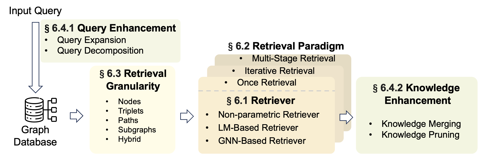

# Graph Retrieval-Augmented Generation: A Survey

Recently, Retrieval-Augmented Generation (RAG) has achieved remarkable success in addressing the challenges of Large Language Models (LLMs) without necessitating retraining. By referencing an external knowledge base, RAG refines LLM outputs, effectively mitigating issues such as ``hallucination'', lack of domain-specific knowledge, and outdated information. However, the complex structure of relationships among different entities in databases presents challenges for RAG systems. In response, GraphRAG leverages structural information across entities to enable more precise and comprehensive retrieval, capturing relational knowledge and facilitating more accurate, context-aware responses. Given the novelty and potential of GraphRAG, a systematic review of current technologies is imperative. This paper provides the first comprehensive overview of GraphRAG methodologies. We formalize the GraphRAG workflow, encompassing Graph-Based Indexing, Graph-Guided Retrieval, and Graph-Enhanced Generation. We then outline the core technologies and training methods at each stage. Additionally, we examine downstream tasks, application domains, evaluation methodologies, and industrial use cases of GraphRAG. Finally, we explore future research directions to inspire further inquiries and advance progress in the field.

**Paper Link:** https://arxiv.org/abs/2408.08921

## 📆 Updates

- [2024/9/10] We released the second version and created the repository on GitHub.
- [2024/8/15] We released the first version of our survey on arXiv.

## 📋 Table of Contents

- [Overview of GraphRAG](#overview)
- [Graph-Based Indexing](#indexing)
- [Graph-Guided Retrieval](#retrieval)
- [Graph-Enhanced Generation](#generation)
- [Downstream Tasks](#tasks)
- [Citation](#citation)
- [Contact Us](#contact)

## <a name="overview">📕 Overview of GraphRAG


We divide GraphRAG into three stages: G-Indexing, G-Retrieval, and G-Generation. We categorize the retrieval sources into open-source knowledge graphs and self-constructed graph data. Various enhancing techniques like query enhancement and knowledge enhancement may be adopted to boost the relevance of the results. Unlike RAG, which uses retrieved text directly for generation, GraphRAG requires converting the retrieved graph information into patterns acceptable to generators to enhance the task performance.

## <a name="indexing">📕 Graph-Based Indexing


The construction and indexing of graph databases form the foundation of GraphRAG, where the quality of the graph database directly impacts GraphRAG's performance. 


## <a name="retrieval">📕 Graph-Guided Retrieval




## <a name="generation">📕 Graph-Enhanced Generation


## <a name="tasks">📕 Downstream Tasks


## <a name="citation">🔗 Citation

If you find this survey useful for your research or development, please cite our paper:

```
@misc{peng2024graphragsurvey,
      title={Graph Retrieval-Augmented Generation: A Survey}, 
      author={Boci Peng and Yun Zhu and Yongchao Liu and Xiaohe Bo and Haizhou Shi and Chuntao Hong and Yan Zhang and Siliang Tang},
      year={2024},
      eprint={2408.08921},
      archivePrefix={arXiv},
      primaryClass={cs.AI},
      url={https://arxiv.org/abs/2408.08921}, 
}
```

## <a name="contact">✉️ Contact Us

If you have any questions or suggestions, please feel free to contact us via:

Email: bcpeng@stu.pku.edu.cn
